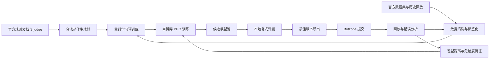
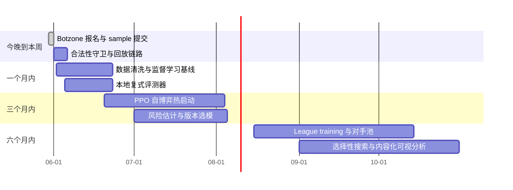

# IJCAI 麻将 AI 竞赛夺冠研究报告

## 执行摘要

如果目标是“参赛”与“尽快进入有效迭代”，今晚最重要的不是训练大模型，而是先把 Botzone 提交流程、合法动作、回放分析链路全部跑通。官方 2026 主赛页给出的时间线是：报名截止与正式轮开始都在 **2026-06-09**，决赛在 **2026-07-07**；Botzone 游戏详情页当前可见 **Simulation-6 / 模拟赛-6 于 2026-05-30 23:55** 开始，后面还有 Simulation-7。官方仓库已经给出四样最关键的东西：**judge、算番器、规则文档、sample.cpp**；Botzone 运行环境则是 **Ubuntu 16.04 x86-64、单核、默认每步 1 秒、内存 256 MB**，并支持 C/C++、Java、JavaScript、C#、Python2/3、Pascal。换言之，今晚最稳妥的路径是：**直接上传官方 `sample.cpp` 先拿到可运行 bot，再做最小启发式改造，而不是先上复杂训练框架。** citeturn53view0turn39search3turn54view0turn55view0turn11view0

如果目标是“赢比赛”，核心优化目标也不该是普通天梯 Elo，而应当是 **官方正式赛真正采用的‘瑞士轮 + 复式赛’排名分**。官方 wiki 解释的复式规则是：同一匹配会在 **4 副牌墙** 下比较，每副牌墙做 **24 个座次全排列**，即 **96 局**；按“一副一比”把 24 局小分累加后转成 **4/3/2/1 排名分**，最后以排名分总和排序、以小分总和作并列比较。这意味着你的训练与评测必须以 **duplicate-aware 的本地评测** 为中心，而不是只看单局和牌率或普通 Elo。citeturn9view0turn53view0

从官方论文与历届公开材料看，近年的高水平路线已经比较清晰：**纯规则/启发式 < 监督学习 < 监督学习热启动 + 自博弈强化学习**。官方综述论文明确指出，前两届比赛中，**监督学习与强化学习方法显著强于基于人工知识的启发式方法**；而第一届比赛前三名都使用了 **PPO + 自博弈** 的范式，冠军还进一步使用了 **reward shaping** 与 **perfect information distillation**。2020 年亚军 ALONG 的公开材料则展示了一条很实用的落地路线：**番型距离等 look-ahead 特征 + ResNet 主干 + 行为克隆 + PPO+GAE + curriculum/self-play**。这条路线不是唯一答案，但它是目前最有证据支撑、最适合作为“冲 Top-10 再冲冠军”的主线。citeturn29search3turn49view1

因此，这份报告的结论非常直接：**今晚**先用官方 sample 建立稳定提交流程、加入模拟赛、搭好回放分析；**一到三周**内做一个“永不非法和牌、不乱 TLE、能用番型距离与向听数做打牌选择”的稳健启发式/监督学习基线；**一到三个月**内补齐本地 judge、duplicate 评测器、数据清洗与行为克隆；**三到六个月**内再做自博弈 PPO、league training、对手池、风险控制与鲁棒性测试。想赢，训练只是其中一半；另一半是 **合法性、评测制度适配、工程稳定性**。citeturn53view0turn29search3turn49view1turn37view0turn38view0

## 官方资源地图

官方资源的关键点在于：**必须以 2026 主赛页 + Botzone 游戏页 + 官方 GitHub + Botzone wiki 为主干**，再把历届结果页和公开报告当作策略情报库。下面这张表按“参赛必用度”排序。citeturn53view0turn54view0

| 资源 | 直达链接 | 你用它做什么 | 开源与许可情况 |
|---|---|---|---|
| 2026 主赛页 | [The 6th International Mahjong AI Competition](https://botzone.org.cn/static/gamecontest2026a.html) | 看时间线、报名入口、样例程序、judge、算番器、数据集入口、公告。2026 页还新增了 **LLM Track 即将公布** 的公告。citeturn53view0 | 官方网页，非开源网页资产 |
| 游戏详情页 | [Chinese-Standard-Mahjong](https://www.botzone.org.cn/game/Chinese-Standard-Mahjong) | 看游戏详情、最近比赛、Bot 排名、**Related Contests** 中的 Simulation 列表。当前可见 Simulation-4 到 Simulation-7，其中 **Simulation-6 为 2026-05-30 23:55**。citeturn13view0turn39search3 | 官方网页，非开源网页资产 |
| 游戏规则 wiki | [Chinese-Standard-Mahjong - Botzone Wiki](https://wiki.botzone.org.cn/index.php?title=Chinese-Standard-Mahjong) | 最关键的 I/O 协议、动作优先级、复式赛制说明、样例程序说明。citeturn8view1turn8view2turn8view3turn9view0 | 官方 wiki，非代码仓库 |
| Bot 运行 wiki | [Bot - Botzone Wiki](https://wiki.botzone.org.cn/index.php?title=Bot/en) | 看支持语言、JSON/Simple 交互、时间/内存限制、Python zip 打包、存储空间、Keep Running。citeturn11view0turn41view1 | 官方 wiki，非代码仓库 |
| 官方 GitHub 根仓库 | [ailab-pku/Chinese-Standard-Mahjong](https://github.com/ailab-pku/Chinese-Standard-Mahjong) | judge、算番器、规则文档、样例 bot 的统一入口。仓库目录明确包含 `fan-calculator-usage`、`judge`、`mahjong-rules`、`sample-bot-Botzone`。citeturn54view0 | 公开仓库；GitHub 页面未显示许可证声明，应按“**许可证未明确**”谨慎使用 |
| 官方 judge | [judge](https://github.com/ailab-pku/Chinese-Standard-Mahjong/tree/master/judge) | 本地复现裁判行为、非法动作惩罚、和牌判定和分数逻辑。citeturn17view0turn37view0turn38view0 | 同上，许可证未明确 |
| 官方算番器用法 | [fan-calculator-usage](https://github.com/ailab-pku/Chinese-Standard-Mahjong/tree/master/fan-calculator-usage) | 学习如何在 C++/Python 中接入官方算番器。citeturn17view0 | 同上，许可证未明确 |
| 官方规则文档目录 | [mahjong-rules](https://github.com/ailab-pku/Chinese-Standard-Mahjong/tree/master/mahjong-rules) | 含中文完整规则 PDF、英文规则 PDF、番种简介、赛制介绍、AI 设计课件。README-zh 明确列出这些文档。citeturn36search2 | 同上，许可证未明确 |
| 官方样例 bot | [sample-bot-Botzone](https://github.com/ailab-pku/Chinese-Standard-Mahjong/tree/master/sample-bot-Botzone) / [sample.cpp](https://github.com/ailab-pku/Chinese-Standard-Mahjong/blob/master/sample-bot-Botzone/sample.cpp) | 今晚最稳妥的上传起点。目录里明确只有 `README.md` 与 `sample.cpp`。citeturn55view0turn56view0 | 同上，许可证未明确 |
| 官方 Python 算番库 | [ailab-pku/PyMahjongGB](https://github.com/ailab-pku/PyMahjongGB) | Python 侧最实用的 legality/shanten/fan 工具。GitHub 页面显示 **MIT license**，并提供 `RegularShanten` 等接口。citeturn30search2 | 开源，MIT |
| Botzone 操作指南 | [instruction_for_IJCAI24_english.pdf](https://botzone.org.cn/static/instruction_for_IJCAI24_english.pdf) | 虽然是 2024 英文版，但 2026 主赛页仍链接它；可用来快速看“创建 bot、加入组、看回放”的 UI 路径。citeturn14view2turn16view0 | 官方 PDF，非开源代码 |
| 历届结果页 | [2020](https://botzone.org.cn/static/gamecontest2020a.html) / [2022](https://botzone.org.cn/static/gamecontest2022a.html) / [2023](https://botzone.org.cn/static/gamecontest2023a.html) / [2024](https://botzone.org.cn/static/gamecontest2024a.html) / [2025](https://botzone.org.cn/static/gamecontest2025a.html) | 看冠军名单、赛制迭代、公开 workshop 资料与公开视频入口。citeturn48view0turn25view0turn46view0turn45view0turn47view0 | 官方网页，非开源网页资产 |

历届冠军与正式结果页对“复制和抄袭”的态度值得你高度重视。2022、2023、2024、2025 的结果页都写了：Top 16 是在 **排除 duplication and copycats** 之后列出的，这说明官方确实会处理重复提交/疑似抄袭问题；如果你想冲名次，必须从一开始就保持代码、模型、训练管线与说明材料的独立性。历届冠军分别是 2020 的 **SuperJong / yata**、2022 的 **随机出牌样例 / zbww**、2023 的 **麻将有风险输钱需谨慎 / 测功能的号**、2024 的 **响亮的名字 / 测功能的号**、2025 的 **超强小登队 / SeaMan**。citeturn48view0turn25view0turn46view0turn45view0turn47view0

从夺冠情报价值看，**2020 年页面尤其重要**。它不仅给出最终排名，还公开了 finalists 的 **YouTube/Bilibili 视频** 和若干 **PDF/PPT 报告**；这比近几届“只给结果、不放代码”更有研究价值。亚军 ALONG 与第四名 USTC 的报告都可以直接用来抽取特征设计、数据清洗、自博弈训练与本地评测思路。citeturn48view0turn49view1turn49view3

## 规则、赛制与裁判行为

### 问题表述

从 AI 视角，这个竞赛不是“普通麻将小程序”，而是一个 **四人、不完美信息、随机发牌、顺序决策、带复杂终局计分** 的多智能体博弈。官方 IJCAI 论文和主赛页都把它定位为：需要同时处理 **隐藏信息、番型规划、出牌选择、对手博弈、长期收益** 的复杂现实型游戏。更关键的是，**正式比赛的目标函数不是天梯 Elo，而是复式赛排名分**；因此一个“单桌爆发高、方差也高”的 bot，在正式赛里不一定优。citeturn18view0turn53view0turn9view0

### 规则速查表

| 主题 | 官方规则摘要 | 对建模的直接含义 | 依据 |
|---|---|---|---|
| 规则基底 | 比赛采用 **Mahjong Competition Rules**，也就是国标麻将/Chinese Official Mahjong。citeturn53view0turn18view1 | 你的策略应围绕 MCR 番型规划，而不是立直麻将逻辑 | citeturn53view0turn18view1 |
| 起和门槛 | 国标 **8 番起和**。官方 wiki 明写“国标麻将 8 番起胡”；judge 代码也会在番数不足时判错和。citeturn8view0turn38view0 | legality guard 必须放在最前面；**永远不要在 Botzone 上“猜和”** | citeturn8view0turn38view0 |
| 复式用牌 | 复式赛使用 **136 张牌，不含 8 张花牌**。citeturn9view0 | 你的 contest bot 应针对 **无花牌** 环境，而不是普通花牌局 | citeturn9view0 |
| 摸牌机制 | 复式赛里每家从自己的 **34 张子牌墙** 顺序摸牌；杠后也从自己牌墙顺序摸，不从牌墙尾摸。citeturn9view0 | 本地 simulator 必须按 **子牌墙** 实现，否则 duplicate 评测全错 | citeturn9view0 |
| 优先级 | 冲突时优先级为 **和牌 > 碰/杠 > 吃牌**。citeturn8view3 | action masking 与 response parser 必须按官方优先级组织 | citeturn8view3 |
| 同时和牌 | 一盘只定 **一位和牌者**；多人同时喊和时，从打牌者按逆时针方向前者为和牌者。citeturn8view0 | 多人竞争胡牌时，局部 EV 要按官方 tie-break 理解 | citeturn8view0 |
| 荒牌与海底 | 当有人牌墙为空时，其上家打出一张牌后，其他家不能吃碰杠；如有人和牌记海底捞月，否则荒牌。摸牌后和牌则记妙手回春。citeturn9view0 | 末盘状态是高风险 bug 区，必须专门做单元测试 | citeturn9view0 |
| 牌表示 | `W/B/T` 三门数牌，`F1-F4` 风牌，`J1-J3` 箭牌，`H1-H8` 花牌。复式赛虽无花牌，但编码仍需兼容。citeturn8view1 | 日志解析器与可视化器都应统一使用官方编码 | citeturn8view1 |
| 复式赛目标 | 4 副牌墙 × 每墙 24 个座次排列；每副牌墙的小分累加后转为 **4/3/2/1 排名分**；最终按排名分总和排序，小分总和 tie-break。citeturn9view0turn53view0 | 本地评测必须按 **duplicate packet** 统计，而不是按单桌平均分 | citeturn9view0turn53view0 |

完整番种与术语，官方仓库在 `mahjong-rules` 目录下给了 **《国标麻将番种及相关术语简介》**、**《中国麻将竞赛规则——1998年国家体育总局颁布》**、补充问答和赛制介绍。对于工程实现，我建议把“完整 81 番表”交给官方算番器，把你自己的模型特征重点放在 **番型距离、最近目标牌型、可行动作特征** 上——这也是 ALONG 公开报告的做法。citeturn36search2turn49view1

### 裁判行为与非法动作惩罚

| 场景 | judge 行为 | 竞赛后果 | 依据 |
|---|---|---|---|
| 非法动作、格式错误、越权吃碰杠等 | `playerError(player, "WA")` | 该玩家 **-30**，其余三家各 **+10**，并直接结束。citeturn37view0turn37view2 | 极其致命；宁可保守 PASS，也不要输出不确定动作 | citeturn37view0turn37view2 |
| 错和 / 番数不足 | judge 在 `checkHu` 中若 `re < 8 + flower_count`，触发 `WH`；复式赛无花牌，实质上就是 `<8`。citeturn38view0 | 同样会走 `playerError`，即 **-30 / +10 / +10 / +10** | citeturn38view0turn37view0 |
| 自摸合法和牌 | 胜者得 **3 × (8 + fan)**，其余三家各 **-(8 + fan)**。citeturn37view4 | 自摸价值显著高；训练奖励不应只看是否和牌 | citeturn37view4 |
| 点和合法和牌 | 胜者得 **24 + fan**；点炮/责任方 **-(8 + fan)**；另外两家各 **-8**。citeturn37view4 | 防守与放铳风险控制是正式赛收益大头 | citeturn37view4 |
| 抢杠和 | 官方 I/O 明确在 `BUGANG` 后其他玩家可输出 `HU`；judge 也专门检查该分支。citeturn8view3turn37view3 | 补杠必须加一层 “是否给他人抢杠和” 评估 | citeturn8view3turn37view3 |

**一个很实用的工程原则**：在 Botzone 上，合法性检查优先级要高于策略质量。只要你偶发 `WA/WH`，复式赛排名会立刻被拖垮。对“是否可胡、是否满足 8 番、是否确实有这张牌、是否仅上家可吃、末牌墙是否还允许鸣牌”等，都应做本地硬校验，而不是信模型输出。这个结论既来自官方 judge 惩罚，也来自比赛目标函数本身。citeturn37view0turn38view0turn9view0

## 提交、运行时与今晚模拟赛清单

### 提交与运行时要点

| 项目 | 官方要求/能力 | 你的建议 |
|---|---|---|
| 运行环境 | Ubuntu 16.04 x86-64，单 CPU core。citeturn11view0 | 不要依赖 GPU、不要指望多线程有实质收益 |
| 默认限制 | 默认每步 **1 秒**、**256 MB**；首回合时间翻倍。citeturn11view0 | 实战目标控制在 **300–500 ms** 内留安全余量 |
| 支持语言 | C/C++、Java、JavaScript、C#、Python2、Python3、Pascal。citeturn11view0 | 今晚首提建议 **C++**，因为官方样例就是单文件 `sample.cpp` |
| 语言倍率 | Java 3 倍、C# 6 倍、JavaScript 2 倍、Python 6 倍。citeturn11view0 | Python 推理可行，但要严格控初始化与 I/O |
| 交互协议 | 支持 **JSON** 与 **Simple** 两种；麻将样例默认展示 JSON。citeturn11view0turn56view0 | 今晚先用官方默认路径，不要自造协议 |
| Python 多文件 | 需打成 zip，根目录必须有 `__main__.py`。citeturn11view0turn41view2 | 若你用 PyTorch/Python，代码进 zip，模型文件放 Storage |
| Storage | Bot 可读写用户存储空间；Python 打包时 **不要把数据文件塞进 zip**，应放“Manage Storage”。citeturn11view0 | 大模型参数与额外词典都放 Storage |
| Keep Running | 可减少冷启动成本；启用后每回合输出后都要额外打印 `>>>BOTZONE_REQUEST_KEEP_RUNNING<<<`。citeturn41view1 | 今晚先不用；等有重型模型初始化再开 |
| 样例程序 | 官方仓库里有 `sample-bot-Botzone/sample.cpp`。citeturn55view0turn56view0 | 这是今晚的最稳提交底座 |

### 今晚最稳妥的参赛流程

下面这张表只保留“今晚必须做”的动作，目的是 **在 Simulation-6 前拿到一个稳定可跑的 bot 版本**。citeturn39search3turn53view0turn55view0turn14view2

| 步骤 | 你现在做什么 | 产出 |
|---|---|---|
| 登录与报名 | 打开 [2026 主赛页](https://botzone.org.cn/static/gamecontest2026a.html)，先注册/登录 Botzone，再从主赛页点击 competition group 报名入口 | 有账号、有比赛组资格 |
| 建 bot | 打开 Botzone 的 `My Bots`，创建新 bot，游戏选择 **Chinese-Standard-Mahjong** | 一个空 bot |
| 最快可提版本 | 直接上传官方 [`sample.cpp`](https://github.com/ailab-pku/Chinese-Standard-Mahjong/blob/master/sample-bot-Botzone/sample.cpp) 作为 C/C++ bot | `v0.0-official-sample` |
| 烟雾测试 | 用首页手动建桌或游戏页 Recent Matches/Replay 路径做自测，确认 bot 能正常 PASS/PLAY，不出现 WA/WH/TLE | 运行链路验证通过 |
| 进模拟赛 | 在 [游戏详情页](https://www.botzone.org.cn/game/Chinese-Standard-Mahjong) 的 **Related Contests** 中进入 **Simulation-6 / 模拟赛-6** | bot 加入今晚模拟赛 |
| 回放记录 | 赛后立刻从回放与 log 抽样 5–10 局，检查是否有非法胡、末盘 bug、超时 | 第一轮错误清单 |
| 最小升级 | 把随机打牌改成“合法动作 + 向听数/番型距离优先”的启发式 | `v0.1-safe-heuristic` |

### 今晚可直接执行的命令

如果你想最快拿到“可提交文件”，建议直接取官方样例。官方仓库目录与文件名都已经明确。citeturn55view0turn56view0

```bash
git clone https://github.com/ailab-pku/Chinese-Standard-Mahjong
cd Chinese-Standard-Mahjong/sample-bot-Botzone

# 直接上传这个文件到 Botzone 新建的 C/C++ bot
# 文件名：sample.cpp
ls
```

如果你一定要今晚走 Python，多文件的最小打包方式如下；注意 **zip 根目录必须有 `__main__.py`**，大型参数文件应走 Botzone Storage，不要打进 zip。citeturn11view0turn41view2

```bash
mkdir my_py_bot
cd my_py_bot
touch __main__.py
zip -r mahjong_bot.zip __main__.py
```

### 官方样例应如何最快改成“能打”的版本

官方 wiki 展示的样例 bot 本质上是 **恢复当前手牌状态后随机出牌**；它已经示范了如何从 `requests + responses` 重建状态、以及如何在 JSON/Simple 交互下输出 `PASS` / `PLAY tile`。你今晚不需要重写整套框架，只需要把最终决策替换成一个安全启发式即可。citeturn9view0turn56view0

我建议你的第一版启发式只做四件事：  
其一，**只有在官方算番器确认 ≥8 番时才 `HU`**。  
其二，若存在合法杠但会明显暴露风险，则先别杠。  
其三，对每张可打牌，计算一个简单分数：`-向听数 * 100 + 有效牌数 * 2 - 危险度`。  
其四，优先保留 **离高价值番型更近** 的结构，例如清一色/混一色/组合龙/三色等候选目标。ALONG 的公开方案就明确把 **番型距离** 与 **最近牌型模式** 当作 look-ahead features；这是目前最值得直接借鉴的启发式方向。citeturn49view1

## 回放、UI 与视频渲染

### 官方 UI 是否开源

目前从**官方仓库**能明确看到的目录只有 `judge`、`fan-calculator-usage`、`mahjong-rules`、`sample-bot-Botzone`，并没有官方 UI/replayer 源码目录；与此同时，官方比赛页与游戏页都提供“**watch full match / replay**”功能，但没有把回放器源码作为官方仓库一部分发布。因此，从“官网可用性”看，官方 UI 是存在的；从“源码公开性”看，**至少在官方仓库与主赛资料里，没有发现官方 UI/replayer 的公开源码入口**。实际工程上，应该把它当成 **可用但未公开开源** 的官方 Web 资产来处理。citeturn54view0turn53view0turn13view0

### 你可以怎样把回放做成抖音视频

| 方法 | 适用场景 | 优点 | 缺点 |
|---|---|---|---|
| 直接录官方 replay 页面 | 今晚就想发视频 | 最快、最稳、和官方观感一致 | 不能自由加危险度/番型解释层 |
| 日志转 HTML 回放 | 想做“科普型”与“复盘型”视频 | 可叠加字幕、危险度、番型候选、策略讲解 | 需要自己写 parser/render |
| 基于本地环境重放 | 想做自动批量渲染 | 可以批量出片、批量分析 | 需要 state reconstruction |
| 赛后人工讲解剪辑 | 想做账号内容质量 | 可把“为什么这样打”讲清楚 | 费时，不适合大批量 |

我给你的推荐顺序是：**今晚先用官方 replay + OBS/CapCut 做第一批内容；接着用自制 HTML renderer 做第二批“讲解型短视频”。** 这样既不耽误模拟赛，又能尽快建立内容资产。官方页面显示可以直接看 full match；Botzone 调试页也明确说明可以看 log、开 debug mode、查看 full log。citeturn53view0turn10search0

### 可直接拿来用的开源辅助项目

| 项目 | 链接 | 价值判断 |
|---|---|---|
| `ccr-cheng/botzone-mahjong-environment` | [GitHub](https://github.com/ccr-cheng/botzone-mahjong-environment) | **最值得当 MCR 本地状态重建 starter**。它是面向 Botzone 国标麻将复式的 Python 环境，README 明确说提供与 Botzone 对应的接口，并带 MIT 许可证。citeturn33view1 |
| `ailab-pku/botzone-local-simulator` | [GitHub](https://github.com/ailab-pku/botzone-local-simulator) | 不是麻将专用 simulator，但带 **dataset_generator**，可下载 Botzone log 并生成对局数据，适合做日志管线模板。citeturn33view0 |
| `ailab-pku/PyMahjongGB` | [GitHub](https://github.com/ailab-pku/PyMahjongGB) | 做 legality / shanten / fan 的 Python 工具最实用。MIT 许可。citeturn30search2 |
| `Lingfeng158/Mxplainer` | [GitHub](https://github.com/Lingfeng158/Mxplainer) | 不是 renderer，但它是 **Official International Mahjong** 的解释/分析工具仓库，可用于风格分析与局面解释。citeturn50search4 |
| `nissymori/mahjax` | [GitHub](https://github.com/nissymori/mahjax) | 这是立直麻将，不是 MCR；但如果你后续要自己重写高速 simulator，它是 GPU/JAX 并行渲染与 rollout 架构的优秀参考。citeturn30search0turn30search1 |

### 最小可行的日志到 HTML 渲染方案

最小方案不需要完整私有手牌重建，只要先把 **公开信息层** 画出来：每一步的 `PLAY/CHI/PENG/GANG/BUGANG`、每家弃牌池、碰吃杠副露、当前事件文本。这已经足够做短视频讲解。官方 wiki 已经给了这些公共事件格式：例如 `3 playerID PLAY Card1`、`3 playerID PENG Card1`、`3 playerID CHI Card1 Card2`、`3 playerID GANG`、`3 playerID BUGANG Card1`。citeturn8view2

下面这段 Python 脚本的输入是假定你已经从 Botzone full log 中抽取出或保留了这些公共事件文本；它会生成一个非常简单的 HTML stepper 回放页。这个版本**不显示私有手牌**，但足够做“公共局面回放 + 讲解字幕”视频底稿。

```python
# log_to_html.py
# 用法：
#   python log_to_html.py public_events.txt replay.html
#
# 输入文件里只要包含类似这些官方公共事件行即可：
#   3 2 DRAW
#   3 2 PLAY T1
#   3 1 PENG W3
#   3 3 CHI T2 W3
#   3 0 GANG
#   3 2 BUGANG W3

import json
import re
import sys
from copy import deepcopy
from pathlib import Path

PAT = re.compile(
    r"\b3\s+([0-3])\s+(DRAW|PLAY|PENG|CHI|GANG|BUGANG|BUHUA)(?:\s+([WBTFJH]\d))?(?:\s+([WBTFJH]\d))?\b"
)

def parse_events(text: str):
    events = []
    for line in text.splitlines():
        for m in PAT.finditer(line):
            events.append(
                {
                    "player": int(m.group(1)),
                    "act": m.group(2),
                    "a": m.group(3),
                    "b": m.group(4),
                    "raw": m.group(0),
                }
            )
    return events

def apply_event(state, e):
    p = e["player"]
    act = e["act"]
    a = e["a"]
    b = e["b"]

    if act == "PLAY" and a:
        state["discards"][p].append(a)
    elif act == "PENG" and a:
        state["melds"][p].append(f"PENG {a}")
        if b:
            state["discards"][p].append(b)
    elif act == "CHI" and a:
        state["melds"][p].append(f"CHI {a}")
        if b:
            state["discards"][p].append(b)
    elif act == "GANG":
        state["melds"][p].append("GANG")
    elif act == "BUGANG" and a:
        state["melds"][p].append(f"BUGANG {a}")
    elif act == "BUHUA" and a:
        state["notes"].append(f"P{p} BUHUA {a}")
    elif act == "DRAW":
        state["notes"].append(f"P{p} DRAW")

    state["last"] = e["raw"]

def build_snapshots(events):
    state = {
        "melds": [[] for _ in range(4)],
        "discards": [[] for _ in range(4)],
        "notes": [],
        "last": "START",
    }
    snaps = [deepcopy(state)]
    for e in events:
        apply_event(state, e)
        snaps.append(deepcopy(state))
    return snaps

HTML = """<!doctype html>
<html lang="zh-CN">
<meta charset="utf-8">
<title>Botzone Mahjong Replay</title>
<style>
body { font-family: system-ui, sans-serif; margin: 24px; }
.wrap { max-width: 1100px; margin: auto; }
.controls { margin-bottom: 16px; display:flex; gap:8px; align-items:center; }
.board { display:grid; grid-template-columns: 1fr 1fr; gap:12px; }
.panel { border:1px solid #ddd; border-radius:12px; padding:12px; }
.badge { display:inline-block; padding:4px 8px; margin:2px; border-radius:8px; background:#f5f5f5; }
.last { font-weight:700; margin:12px 0; }
.small { color:#666; font-size: 14px; }
</style>
<div class="wrap">
  <h1>Botzone Mahjong Replay</h1>
  <div class="controls">
    <button onclick="step(-1)">上一步</button>
    <button onclick="step(1)">下一步</button>
    <input id="idx" type="range" min="0" max="{MAX}" value="0" oninput="render(+this.value)">
    <span id="counter"></span>
  </div>
  <div class="last" id="last"></div>
  <div class="board" id="board"></div>
  <div class="panel">
    <div class="small">说明：此版本只渲染公共信息层（弃牌、副露、事件），便于快速做讲解视频底稿。</div>
  </div>
</div>
<script>
const snaps = {SNAPS};
let cur = 0;
function render(i) {{
  cur = Math.max(0, Math.min(snaps.length - 1, i));
  document.getElementById("idx").value = cur;
  document.getElementById("counter").textContent = `${{cur}} / ${{snaps.length - 1}}`;
  const s = snaps[cur];
  document.getElementById("last").textContent = "当前事件： " + s.last;
  const board = document.getElementById("board");
  board.innerHTML = "";
  for (let p = 0; p < 4; p++) {{
    const panel = document.createElement("div");
    panel.className = "panel";
    const melds = s.melds[p].map(x => `<span class="badge">${{x}}</span>`).join("");
    const discards = s.discards[p].map(x => `<span class="badge">${{x}}</span>`).join("");
    panel.innerHTML = `
      <h3>Player ${{p}}</h3>
      <div><strong>副露：</strong> ${{melds || "无"}}</div>
      <div style="margin-top:8px;"><strong>弃牌：</strong> ${{discards || "无"}}</div>
    `;
    board.appendChild(panel);
  }}
}}
function step(delta) {{ render(cur + delta); }}
render(0);
</script>
</html>
"""

def main():
    if len(sys.argv) != 3:
        print("Usage: python log_to_html.py public_events.txt replay.html")
        raise SystemExit(1)

    src = Path(sys.argv[1]).read_text(encoding="utf-8", errors="ignore")
    events = parse_events(src)
    snaps = build_snapshots(events)
    out = HTML.replace("{MAX}", str(max(0, len(snaps) - 1))).replace(
        "{SNAPS}", json.dumps(snaps, ensure_ascii=False)
    )
    Path(sys.argv[2]).write_text(out, encoding="utf-8")
    print(f"written {sys.argv[2]} with {len(events)} parsed events")

if __name__ == "__main__":
    main()
```

如果你想把这个 HTML 直接变成视频，最省事的自动化链路是：**Python 生成 replay.html → 浏览器全屏播放 → OBS/ffmpeg 录制**。等第二版再加上“候选番型、向听数、放铳危险度、字幕解释”。这条路线和官方 UI 不冲突，反而非常适合你做抖音内容。citeturn8view2turn10search0

## 基线、夺冠策略与训练基础设施

### 历届强队方法给出的明确信号

官方综述论文给出的结论很强：在 IJCAI 2020 和 2022 两届比赛中，**监督学习与强化学习方法整体强于纯启发式方法**；第一届比赛前三名都采用了 **PPO + 分布式 actor-critic + 最新模型自博弈收集数据** 的共同范式，差异主要体现在是否有监督学习热启动、reward shaping、以及 perfect information distillation。这个结论对“想赢比赛”的人非常重要，因为它意味着：**规则知识要有，但不能停在规则知识。** 真正能冲冠的路线，必须进入数据驱动与自博弈阶段。citeturn29search3

2020 年亚军 **ALONG** 的公开报告提供了非常具体、可复用的工程细节：它把特征分成 **base features、look-ahead features、available-action features**，其中 look-ahead 明确包括 **到每个番型的距离** 与 **最近牌型模式**；网络是 **50 个 ResNet block**，同时输出 policy 和 value；先用主办方提供的人类数据做行为克隆，再做 **PPO+GAE** 强化学习，并使用“**从 100 副牌墙起步、胜率超过 80% 后翻倍**”的 curriculum/self-play 训练方式。对参赛者来说，这几乎就是一条可执行的“从稳健基线走向竞赛强度”的路线图。citeturn49view1

2020 年第四名 USTC 的报告则展示了另一条成本更低、但仍有竞争力的路线：**强监督学习基线**。他们基于比赛数据清洗出赢家状态-动作对，做花色交换与数字翻转增强，并在 2 万局本地对抗 3 个随机 bot 的评测里，拿到约 **0.73** 的胜率和更高的平均分。这说明如果你今晚到未来两周的目标是“迅速脱离样例 bot 水平”，那么 **数据清洗 + 高质量监督学习 + 合法性与特征工程** 的 ROI 其实很高。citeturn49view3

### 按“投入产出比”排序的夺冠组件

下表把“证据强度”和“竞赛价值”放在一起看。前四项属于**必须做**，后几项属于**冲冠增强项**。

| 组件 | 证据基础 | 工程投入 | 预期收益 | 建议优先级 |
|---|---|---:|---:|---:|
| 合法动作层 + 强制算番校验 | judge 对 WA/WH 直接 -30；8 番起和。citeturn37view0turn38view0 | 低 | 极高 | 最高 |
| 监督学习预训练 | 官方论文与 2020/2022 结果都支持；2020 USTC 方案成本相对低。citeturn29search3turn49view3 | 中 | 高 | 很高 |
| 番型距离/最近模式/可行动作特征 | ALONG 公开方案明确使用。citeturn49view1 | 中 | 高 | 很高 |
| PPO 自博弈热启动 | 官方论文指出第一届前三名都走这条路。citeturn29search3 | 高 | 很高 | 很高 |
| duplicate-aware 本地评测器 | 官方正式赛就是复式排名分。citeturn9view0turn53view0 | 中 | 很高 | 很高 |
| opponent pool / league training | 官方材料未逐项公开，但这是对抗环境非平稳性的自然延伸；属于强烈建议的工程推断 | 高 | 高 | 高 |
| 风险估计器 | 与点和计分、放铳惩罚直接相关。citeturn37view4 | 中 | 高 | 高 |
| 对手建模 | 官方主赛页把 opponent modeling 明列为潜在受益方法。citeturn53view0 | 高 | 中高 | 中高 |
| 选择性搜索 / MCTS | 官方主赛页与论文都提到 MCTS/heuristic search 可有帮助。citeturn53view0turn18view1 | 很高 | 中 | 中 |
| MuZero 类模型化搜索 | 现有官方公开冠军材料并未显示它是主流路线 | 很高 | 不确定 | 低 |

### 推荐的系统架构



### 数据与训练基础设施

| 资源 | 链接 | 用法 |
|---|---|---|
| 官方“强 AI 数据集”入口 | [2026 主赛页](https://botzone.org.cn/static/gamecontest2026a.html) | 官方 2026 页明确写有 **game datasets from strong AIs**；这是最应该优先争取的数据源。citeturn53view0 |
| 官方人类对局数据入口 | [2020 主赛页](https://botzone.org.cn/static/gamecontest2020a.html) | 2020 页给出了 human player matches dataset 的入口。citeturn48view0 |
| 人类对局数据规模说明 | [ccr 环境 README](https://github.com/ccr-cheng/botzone-mahjong-environment) | 这是**非官方二手说明**，但它给出一个很有用的量级：约 12140 场流局、132994 场自摸、385324 场点炮。citeturn34view3 |
| Python 算番/向听数 | [PyMahjongGB](https://github.com/ailab-pku/PyMahjongGB) | legality、shanten、feature engineering 的基础设施。MIT。citeturn30search2 |
| 本地 MCR 环境 | [ccr 环境](https://github.com/ccr-cheng/botzone-mahjong-environment) | 适合做本地 rollout、状态重建、C++ bot 包装。MIT。citeturn33view1 |
| Botzone 日志批量化工具 | [botzone-local-simulator](https://github.com/ailab-pku/botzone-local-simulator) | 尽管不是麻将专用，但其 dataset_generator 结构很适合做日志抓取模板。citeturn33view0 |
| 风格解释与 bot profiling | [Mxplainer](https://github.com/Lingfeng158/Mxplainer) | 适合做风格对比、策略解释、内容制作。citeturn50search4 |
| 高速 GPU/JAX 参考 | [Mahjax](https://github.com/nissymori/mahjax) | 它是立直麻将，但展示了 GPU 上并行麻将模拟可达到的上限：论文报告在 8×A100 上可到每秒百万至两百万 step 量级。citeturn30search0turn30search8 |

在框架选择上，我的建议是：**推理端优先 C++ 或轻量 Python；训练端优先 PyTorch；如果你要自己重写高速 simulator，再考虑 JAX。** 原因很简单：Botzone 线上是 CPU 环境，而你在竞赛前 1–2 个月最需要的是“实验快、导出稳、排错易”，不是最时髦的训练栈。Mahjax 这类 JAX 项目更像是 **高吞吐 rollout 架构的参考模板**，不是今晚就该迁移的落地栈。citeturn11view0turn30search0

### 建议起点超参数与算力区间

下面不是官方规定，而是我基于历届公开方案与当前工程现实给你的**建议起点**。组织方没有规定训练预算，所以这里只能给区间，不给“唯一正确值”。

| 路线 | 建议起点 | 典型算力 | 适用阶段 |
|---|---|---|---|
| 监督学习 BC | ResNet18/34；batch 1024–2048；lr 1e-3 起；cosine 或 plateau 衰减；交叉熵 + 非法动作 mask | 1×4090/3090 或 1×A100，1–3 天 | MVP 到 Top-30 |
| PPO 热启动 | γ 0.997；GAE λ 0.95；clip 0.2；entropy 0.01–0.02；rollout 64–256；8–16 minibatches | 1–4 GPU + 32–128 CPU workers；1–3 周 | Top-30 到 Top-10 |
| League / opponent pool | 维护历史 checkpoint、启发式 bot、监督模型、随机 bot 混合对手池；按 duplicate packet 选优 | 4–8 GPU + 较多 CPU rollout | Top-10 到冲冠 |
| MuZero/搜索增强 | 只在关键决策点做 selective search，不做全局重规划 | 高工程成本，算力弹性大 | 已经稳 Top-10 后再考虑 |

我的判断是：**三个月冲 Top-10，最现实的主线是“强监督起步 + PPO 自博弈 + duplicate-aware 选模”；六个月冲冠军，再加 league training、风险估计和更强的本地评测。** 这条路线与官方公开材料的一致性最高。citeturn29search3turn49view1turn49view3

## 评测、工程、时间表与风险

### 本地评测协议

你的本地评测必须和正式赛目标尽量同构。我的建议是：以 **duplicate packet** 为最小评测单位，即固定 4 副牌墙、每副牌墙跑 24 个座次排列，最后统计 **排名分、总小分、放铳率、非法动作率、TLE 率**。这是因为官方 wiki 已经明确说明复式的主要作用就是 **降低随机性**，而正式赛也正是用这个目标来决胜。citeturn9view0turn53view0

具体指标上，建议把  
**主指标** 设为：duplicate 排名分；  
**副指标** 设为：duplicate 小分总和；  
**稳定性指标** 设为：标准差、95% 区间、非法动作率、TLE 率；  
**内容指标** 设为：可解释性样例池。  
这样做的好处是，你不会被“单次跑得很高”的偶然结果误导。这个问题在麻将尤其严重，因为官方赛制就是为了压低这种方差。citeturn9view0

### 最小工程模板

```text
mahjong-ai/
  botzone/
    sample.cpp
    export_botzone.py
    package_python_bot.sh
  core/
    state.py
    legal.py
    shanten.py
    fan_guard.py
    danger.py
  features/
    base_features.py
    fan_distance.py
    action_features.py
  policy/
    model.py
    infer.py
    checkpoints/
  data/
    raw_logs/
    processed/
    walls/
  train/
    train_bc.py
    train_ppo.py
    league.py
  eval/
    duplicate_eval.py
    opponents.yaml
    seedsets/
  replay/
    parse_log.py
    render_html.py
  tests/
    test_legality.py
    test_hu_guard.py
    test_duplicate_eval.py
    test_timeout_budget.py
  docs/
    experiments.md
    bot_versions.md
```

### CI 与上线检查表

| 检查项 | 标准 |
|---|---|
| 合法动作单测 | 对胡、吃、碰、杠、抢杠和、末牌墙边界做单测 |
| judge 对齐 | 本地 judge smoke test 至少覆盖 1000 局 |
| 时间预算 | 任一回合推理耗时 p99 < 500 ms |
| 非法输出 | 5 万局随机回放重放中 WA/WH = 0 |
| 包装检查 | C++ 单文件或 Python zip 根目录 `__main__.py` 正确 |
| 存储检查 | 外部模型文件全部从 Storage 读取成功 |
| 回放抽检 | 每个候选版本随机抽 10 局看 replay |
| 版本记录 | 记录训练数据、checkpoint、git commit、Botzone version ID |

### 三个月与六个月时间表



### 资源与预算区间

比赛官方没有给出“建议算力预算”，所以这里只能给**经验范围**。如果你是单人/双人小队，想在合理预算下冲 Top-10，我建议把预算拆成“数据与评测 CPU” + “训练 GPU”两部分。

| 目标 | 团队配置 | 经验预算 | 说明 |
|---|---|---:|---|
| 先稳参赛 | 1 人 | 近乎 0–2000 RMB | 官方样例 + 启发式 + 本地规则校验即可 |
| 冲 Top-30 | 1–2 人 | 5000–20000 RMB | 监督学习 + 少量本地 rollout |
| 冲 Top-10 | 2–3 人 | 20000–80000 RMB | 需要持续 duplicate 评测与自博弈 |
| 冲冠军 | 3–4 人 | 80000–200000 RMB | 需要长期 league、自博弈、数据工程和严格评测 |

### 风险与应对

| 风险 | 表现 | 应对 |
|---|---|---|
| 许可证与 IP 不清 | 官方主仓库未明确显示许可证 | 官方仓库只作研究/竞赛参考；你自己的提交代码与论文材料保持原创 |
| copycat 风险 | 官方结果页明确会排除 duplication/copycats | 从第一天开始保存训练日志、代码提交、模型血缘 |
| 过拟合天梯 | 天梯 Elo 不等于正式 duplicate 排名 | 一律用 duplicate packet 选模 |
| 非法动作/错和 | judge 直接 -30 | legality guard 先于策略网络 |
| TLE | CPU 冷启动与大模型加载过慢 | 首版不用重模型；必要时再开 Keep Running |
| UI 不开源 | 无法直接改官方 replay | 自建 HTML renderer；官方 UI 专门用于录屏 |
| 数据质量参差 | 人类/AI log 噪声高 | 先做数据清洗、赢家子集、异常局剔除 |

### 今晚只做这几件事

如果你今晚时间非常有限，就只做下面五件事：  
先从 [官方样例目录](https://github.com/ailab-pku/Chinese-Standard-Mahjong/tree/master/sample-bot-Botzone) 取 `sample.cpp`，在 Botzone 建一个新的 **Chinese-Standard-Mahjong** bot 并上传；然后从 [2026 主赛页](https://botzone.org.cn/static/gamecontest2026a.html) 进入比赛组报名，再去 [游戏详情页](https://www.botzone.org.cn/game/Chinese-Standard-Mahjong) 的 **Related Contests** 里加入 **Simulation-6**；赛后立刻抽样看回放与 full log；最后把随机打牌改成“**只合法胡、按向听数/番型距离选打牌**”的启发式版本，作为 `v0.1`。这套动作能把你从“还没入场”直接推进到“已经开始积累竞赛数据与内容素材”的状态。citeturn55view0turn53view0turn39search3turn10search0